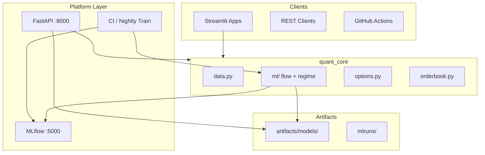

# Architecture — Crypto Quant Nexus 3.0

## System overview

Crypto Quant Nexus is a **three-layer** platform:

1. **Presentation** — five Streamlit analytics apps + Nexus Hub launcher
2. **Quant engine** — shared `quant_core` library (data, metrics, options, order book, ML)
3. **Research** — Alpha fusion, purged walk-forward backtests, universe ranking
4. **Platform** — FastAPI headless API, MLflow tracking, Docker Compose, GitHub Actions CI

## DevOps

| Component | Path | Purpose |
|-----------|------|---------|
| CI pipeline | `.github/workflows/ci.yml` | Lint (Ruff), pytest + coverage, offline training, Docker smoke |
| Nightly MLOps | `.github/workflows/mlops-nightly.yml` | Retrain models, upload artifacts |
| Hub container | `Dockerfile` | Streamlit Nexus Hub |
| API container | `Dockerfile.api` | FastAPI with healthcheck |
| Local stack | `docker-compose.yml` | Hub + API + MLflow |
| Makefile | `Makefile` | `make test`, `make train`, `make api` |

## MLOps

| Stage | Implementation |
|-------|----------------|
| Feature engineering | `quant_core/ml/flow_model.py`, `regime_model.py` |
| Training | `mlops/training/train_*.py`, `scripts/train_all.py` |
| Registry / tracking | MLflow when `MLFLOW_TRACKING_URI` is set |
| Artifacts | `artifacts/models/flow_alpha`, `regime_nexus` (joblib + metadata.json) |
| Inference | Streamlit apps, FastAPI `/v1/ml/*` |

Training is **deterministic offline** in CI (`--no-live`) so pipelines are reproducible without exchange keys.

## API surface

| Endpoint | Description |
|----------|-------------|
| `GET /health` | Service health |
| `GET /v1/ohlcv` | OHLCV with feed metadata |
| `GET /v1/funding` | Cross-venue funding snapshot |
| `GET /v1/metrics/risk` | Sharpe, drawdown, vol |
| `POST /v1/options/greeks` | Option Greeks |
| `GET /v1/options/iv` | Implied volatility solver |
| `GET /v1/ml/flow/signal` | OFI gradient-boosting signal |
| `GET /v1/ml/regime/current` | Current K-Means regime |
| `GET /v1/ml/models` | Loaded artifact status |

Interactive docs: `http://localhost:8000/docs` after `make api`.

## Design decisions

- **Train/serve separation**: ML logic lives in `quant_core/ml`, not duplicated in UI code.
- **Graceful degradation**: Live CCXT → Yahoo Finance → synthetic; API and UI share the same path.
- **No secrets required**: Public endpoints and synthetic data keep demos portable.
- **Portfolio narrative**: Quant depth (AS, BS, OFI) + engineering depth (CI, containers, MLOps).
