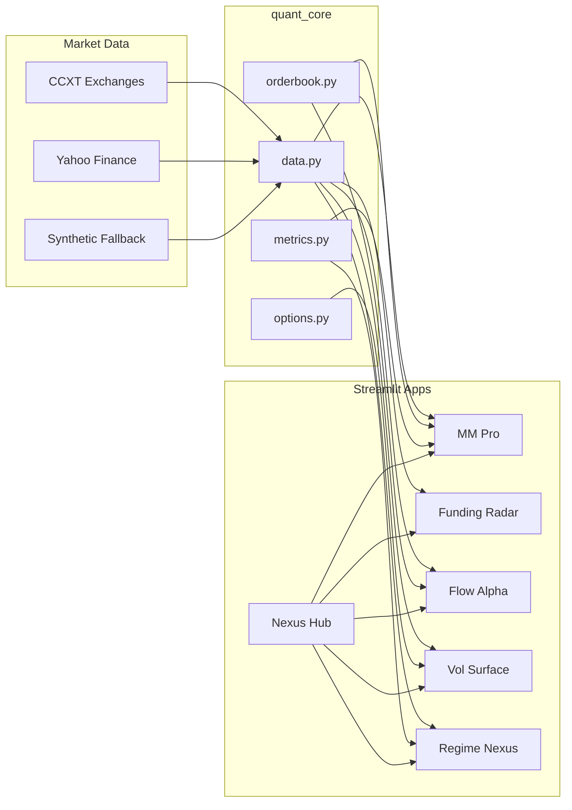

# Crypto Quant Nexus 3.0

<p align="center">
  <strong>Institutional-grade crypto quantitative analytics for research, demos, and product showcases</strong>
</p>

<p align="center">
  <a href="https://github.com/rushi-7388/Crypto-Quant-Nexus/actions/workflows/ci.yml">
    
  </a>
  &nbsp;
  <a href="https://github.com/rushi-7388">GitHub</a> ·
  Python 3.11+ · Streamlit · FastAPI · MLflow · MIT License
</p>

<p align="center">
  <em>v3.0 Global Research Edition — alpha fusion · walk-forward backtests · 6-asset universe</em>
</p>

---

## Overview

**Crypto Quant Nexus** is a modular quant platform built for the 2026 era. It packages five production-style analytics products behind a unified design system and shared `quant_core` library — each deployable as its own live Streamlit app or sold/upgraded as separate tiers.

| | |
|---|---|
| **Creator** | [Rushi Dave](https://github.com/rushi-7388) |
| **Repository** | [github.com/rushi-7388/Crypto-Quant-Nexus](https://github.com/rushi-7388/Crypto-Quant-Nexus) |
| **Version** | 3.0.0 |
| **License** | [MIT](LICENSE) © 2026 Rushi Dave |

Use it to:

- Run **real-time dashboards** with live CCXT / Yahoo Finance data (synthetic fallback when offline)
- **Deploy publicly** on Streamlit Cloud, Docker, or Render for portfolio and client demos
- Demonstrate **quant engineering** skills for internships, jobs, or commercial upgrades

---

## Platform modules

| # | Product | Directory | Description |
|---|---------|-----------|-------------|
| 1 | **MM Pro** | [`mm-engine/`](mm-engine/) | Avellaneda–Stoikov market making, LOB depth, inventory-aware spreads, session PnL |
| 2 | **Funding Radar** | [`funding-radar/`](funding-radar/) | Cross-venue perpetual funding rates, arb edge (bps), carry history |
| 3 | **Flow Alpha** | [`flow-alpha/`](flow-alpha/) | Order flow imbalance (OFI), liquidity pressure, gradient-boosting signals |
| 4 | **Vol Surface** | [`vol-surface/`](vol-surface/) | 3D implied volatility surface, smile/skew, Black–Scholes Greeks |
| 5 | **Regime Nexus** | [`regime-nexus/`](regime-nexus/) | K-Means regime detection (bull / bear / accumulation / panic), transition matrix |
| ★ | **Alpha Terminal** | [`alpha-terminal/`](alpha-terminal/) | **Flagship** — multi-signal fusion, backtests, universe rank, data quality |
| — | **Nexus Hub** | [`nexus-hub/`](nexus-hub/) | Central launcher and deployment entry point |

---

## Features by module

### 1. MM Pro — Market Making Engine

- Simulated **limit order book** with bid/ask depth charts
- **Avellaneda–Stoikov** optimal bid/ask and spread (bps)
- Inventory limits, fill simulation, and **PnL vs inventory** session chart
- Sharpe ratio and max drawdown on simulated equity
- Live OHLCV for BTC, ETH, SOL (CCXT → Yahoo Finance → synthetic)

### 2. Funding Radar — Perpetual Funding Arbitrage

- Multi-venue funding snapshot (Binance, Bybit, OKX via CCXT when available)
- **Arb edge** ranking in basis points with configurable threshold alerts
- Annualized carry estimates and historical funding curves
- Opportunity table with live vs synthetic source labels

### 3. Flow Alpha — Order Flow Imbalance Predictor

- **Cont-style OFI** from bid/ask volume dynamics
- Liquidity pressure heatmaps and rolling OFI overlays on price
- **Gradient Boosting** classifier for short-horizon direction
- Model accuracy, confidence score, and feature-importance panel

### 4. Vol Surface — Volatility & Options Analytics

- Synthetic crypto **options chain** across maturities and strikes
- **Implied volatility** via Newton–Raphson on Black–Scholes prices
- Interactive **3D IV surface** and 30-day volatility smile
- Delta, gamma, vega, theta on ATM and chain tables

### 5. Regime Nexus — Market Regime Detection

- Feature engineering: returns, rolling vol, momentum, range %
- **K-Means** clustering into interpretable regimes
- Price series colored by regime; 2D feature-space scatter
- **Regime transition matrix** for state-change analytics

---

## Architecture

```text
Crypto-Quant-Nexus/
│
├── quant_core/                 # Shared quant library
│   ├── brand.py                # Product identity & version
│   ├── data.py                 # CCXT, yfinance, synthetic OHLCV & funding
│   ├── metrics.py              # Sharpe, drawdown, annualized vol
│   ├── orderbook.py            # LOB sim, OFI, Avellaneda–Stoikov
│   ├── options.py              # Black–Scholes, IV, Greeks
│   └── theme.py                # Unified Streamlit UI theme
│
├── nexus-hub/                  # Portfolio launcher (deploy entry)
├── mm-engine/
├── funding-radar/
├── flow-alpha/
├── vol-surface/
├── regime-nexus/
│
├── alpha-terminal/             # Flagship research command center (v3)
├── quant_core/research/        # Alpha fusion + walk-forward backtests
├── quant_core/platform/        # Asset universe, parquet cache, data quality
├── api/                        # FastAPI headless service (:8000)
├── mlops/training/             # Offline training jobs (Flow Alpha, Regime)
├── tests/                      # pytest suite (quant_core + API)
├── .github/workflows/          # CI + nightly MLOps retrain
├── artifacts/models/           # Persisted ML artifacts (gitignored binaries)
├── requirements.txt            # Root dependencies (all modules)
├── Dockerfile                  # Container deploy (hub on :8501)
├── Dockerfile.api              # API container
├── docker-compose.yml          # Hub + API + MLflow stack
├── Makefile                    # dev, test, train, api shortcuts
├── ARCHITECTURE.md             # System design & MLOps map
├── render.yaml                 # Render.com blueprint
├── .streamlit/config.toml      # Dark institutional theme
└── LICENSE
```



---

## Quick start

### Prerequisites

- Python **3.11** or newer
- `pip` and optional `git`

### Install

```bash
git clone https://github.com/rushi-7388/Crypto-Quant-Nexus.git
cd Crypto-Quant-Nexus

python -m venv .venv

# Windows
.venv\Scripts\activate

# macOS / Linux
# source .venv/bin/activate

pip install -r requirements.txt
```

### Run Alpha Terminal (flagship v3)

```bash
streamlit run alpha-terminal/app.py
```

Unified research UI: composite alpha, purged walk-forward backtests, universe ranking.

### Run the hub (launcher)

```bash
streamlit run nexus-hub/app.py
```

Opens the portfolio launcher at `http://localhost:8501`.

### DevOps & MLOps (v2.1)

```bash
# Install dev tooling
pip install -r requirements-dev.txt

# Lint + unit tests + coverage
make test

# Train ML models offline (writes artifacts/models/)
make train

# Headless REST API (OpenAPI at /docs)
make api

# Full stack: Streamlit hub + FastAPI + MLflow
docker compose up --build
```

See [ARCHITECTURE.md](ARCHITECTURE.md) for CI workflows, artifact layout, and API reference.

### Run a single module

```bash
streamlit run mm-engine/app.py
streamlit run funding-radar/app.py
streamlit run flow-alpha/app.py
streamlit run vol-surface/app.py
streamlit run regime-nexus/app.py
```

Or use each module’s launcher:

```bash
python mm-engine/main.py
```

---

## Deploy live (public URL)

### Streamlit Community Cloud (free)

1. Push this repository to GitHub: [github.com/rushi-7388](https://github.com/rushi-7388)
2. Sign in at [share.streamlit.io](https://share.streamlit.io)
3. **New app** → select your repo
4. **Main file path:** `nexus-hub/app.py` (or any module’s `app.py`)
5. **Requirements file:** `requirements.txt` (repo root)
6. Deploy and add the live URL to your resume, LinkedIn, or pitch deck

| App to deploy | Main file path |
|---------------|----------------|
| Full suite hub | `nexus-hub/app.py` |
| Market making | `mm-engine/app.py` |
| Funding arb | `funding-radar/app.py` |
| Order flow | `flow-alpha/app.py` |
| Vol surface | `vol-surface/app.py` |
| Regime ML | `regime-nexus/app.py` |

### Docker

```bash
# Streamlit hub only
docker build -t cryptoquant-nexus:2.1 .
docker run -p 8501:8501 cryptoquant-nexus:2.1

# Full platform (hub + API + MLflow)
docker compose up --build
```

| Service | URL |
|---------|-----|
| Nexus Hub | http://localhost:8501 |
| REST API | http://localhost:8000/docs |
| MLflow | http://localhost:5000 |

### Render (split hub + API)

The [`render.yaml`](render.yaml) blueprint deploys **two** free web services:

| Service | Image | URL (example) |
|---------|--------|----------------|
| `cryptoquant-nexus-hub` | `Dockerfile` | `https://cryptoquant-nexus-hub.onrender.com` |
| `cryptoquant-nexus-api` | `Dockerfile.api` | `https://cryptoquant-nexus-api.onrender.com/docs` |

**Steps**

1. Push to GitHub and open [Render](https://dashboard.render.com) → **New** → **Blueprint**.
2. Select this repo; apply the blueprint (both services).
3. When live, open the **hub** URL — use **Open API docs (Swagger)** (wired via `API_DOCS_URL` from the API service).

Full walkthrough: **[docs/deploy-render.md](docs/deploy-render.md)**.

Manual two-service setup, health checks, and `curl` verification are documented there.

---

## Tech stack

| Layer | Technologies |
|-------|----------------|
| UI | [Streamlit](https://streamlit.io), custom dark theme |
| API | [FastAPI](https://fastapi.tiangolo.com), Uvicorn |
| Charts | [Plotly](https://plotly.com/python/) |
| Numerics | NumPy, Pandas, SciPy |
| ML | scikit-learn (K-Means, Gradient Boosting), joblib artifacts |
| MLOps | [MLflow](https://mlflow.org), GitHub Actions nightly retrain |
| DevOps | Docker Compose, Ruff, pytest, coverage |
| Markets | [CCXT](https://github.com/ccxt/ccxt), [yfinance](https://github.com/ranaroussi/yfinance) |
| Options | Black–Scholes, implied vol solver, Greeks |

**Pinned dependencies:** see [`requirements.txt`](requirements.txt).

---

## Shared library (`quant_core`)

All apps import from `quant_core` for consistent behavior:

| Module | Purpose |
|--------|---------|
| `data.resolve_price_feed()` | Live OHLCV with automatic fallback chain |
| `data.fetch_funding_rates_demo()` | Cross-venue funding table |
| `orderbook.avellaneda_stoikov_spread()` | Optimal MM quotes |
| `orderbook.order_flow_imbalance()` | OFI increment |
| `options.implied_volatility()` | IV from market price |
| `metrics.sharpe_ratio()` | Risk-adjusted return metric |
| `ml.train_flow_model()` | OFI gradient boosting + artifact I/O |
| `ml.train_regime_model()` | K-Means regimes + transition matrix |
| `research.composite_alpha()` | Multi-signal fusion score ∈ [-1, 1] |
| `research.run_flow_alpha_backtest()` | Purged walk-forward ML backtest |
| `platform.ohlcv_quality_report()` | Data quality contract |

**API v2:** `/v2/alpha/composite`, `/v2/alpha/universe-rank`, `/v2/research/backtest/flow`, `/v2/data/quality`, `/v2/universe`

See [docs/RESEARCH.md](docs/RESEARCH.md) for methodology.

Extend `quant_core` once — all products and the REST API inherit the upgrade.

---

## Product tiers (commercial positioning)

| Tier | Includes |
|------|----------|
| **Starter** | All five modules, synthetic + public data feeds (this repo) |
| **Pro** | API keys, alerts, multi-asset watchlists, branded subdomain |
| **Enterprise** | REST API (included in v2.1), custom strategies, dedicated deploy, SLA |

---

## Configuration

| File | Role |
|------|------|
| [`.streamlit/config.toml`](.streamlit/config.toml) | Theme colors, server headless mode |
| [`quant_core/brand.py`](quant_core/brand.py) | Product name, version, author, GitHub URL |
| Per-module `requirements.txt` | Same stack as root; use root file for deploy |
| [`.env.example`](.env.example) | `LOG_LEVEL`, `API_PORT`, `API_DOCS_URL`, `MLFLOW_TRACKING_URI` |
| [`docs/deploy-render.md`](docs/deploy-render.md) | Render split deploy (hub + API) |

No API keys are required for the default demo. Live CCXT calls use public endpoints; rate limits may apply.

Copy `.env.example` to `.env` when running API, training, or Compose locally.

---

## Roadmap

- [ ] WebSocket streaming for sub-minute LOB updates
- [ ] Backtest reports (PDF/HTML export from MM and Flow Alpha)
- [x] Persisted model training + artifact registry (`artifacts/models/`, MLflow)
- [x] FastAPI layer over `quant_core` (`api/main.py`, `make api`)
- [x] CI/CD (Ruff, pytest, Docker smoke) and nightly MLOps retrain
- [x] Multi-signal alpha fusion + walk-forward backtests (v3)
- [x] 6-asset universe, parquet cache, data quality contracts (v3)
- [x] Alpha Terminal flagship research UI (v3)
- [ ] Auth + billing hooks for Pro / Enterprise tiers
- [ ] Additional assets: altcoins, FX, equity crypto proxies

---

## Disclaimer

This software is for **education and research only**.

It does **not** constitute financial, investment, or trading advice. It is **not** audited production trading infrastructure. Simulated and historical metrics do not guarantee future performance. Use at your own risk.

---

## License

Released under the [MIT License](LICENSE).

Copyright © 2026 Rushi Dave.

---

## Contact

**Rushi Dave**

- GitHub: [github.com/rushi-7388](https://github.com/rushi-7388)

For issues, feature requests, or collaboration, open a GitHub issue on this repository.
